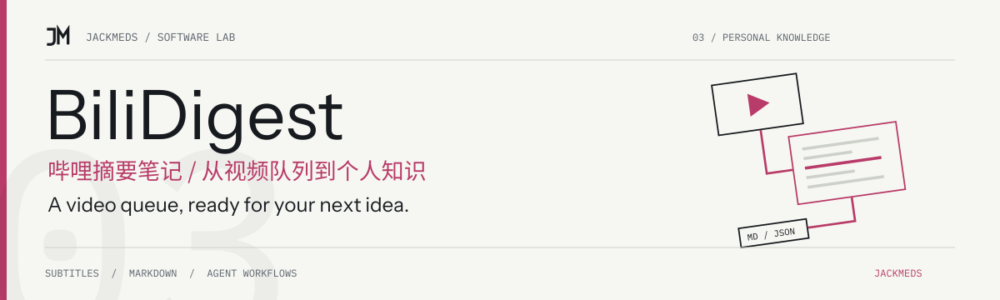
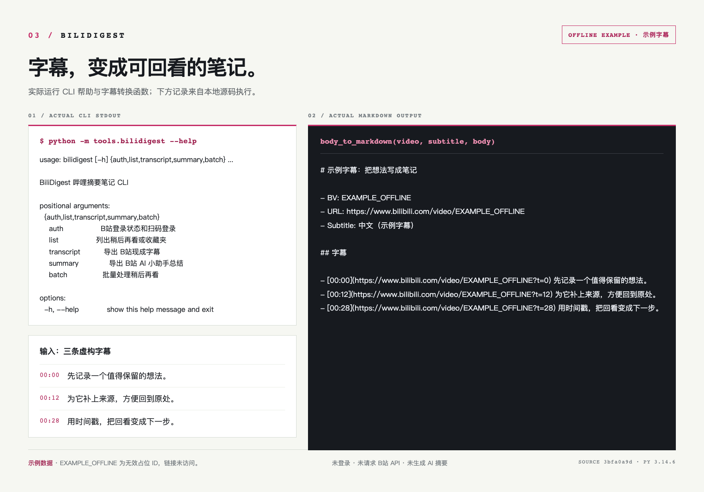

<!-- jackmeds-brand:start -->
<picture>
  <source media="(prefers-color-scheme: dark)" srcset="assets/brand/hero-dark.svg">
  
</picture>
<!-- jackmeds-brand:end -->

# BiliDigest

Turn Watch Later videos into searchable notes with a path back to the source.

BiliDigest exports subtitles and summaries from your own logged-in Bilibili account. It reads Watch Later and Favorites, prefers existing subtitles and Bilibili AI Assistant summaries, and writes Markdown, SRT and JSON for personal agent workflows.

[Quick start](#quick-start) · [Batch and login reference](docs/usage.en.md) · [Agent Skill](skills/bili-digest/SKILL.md) · [中文](README.md)

## From video to notes



Markdown subtitles retain the source video and timestamp links. Exports live under `output/bilidigest/<date>/`; a subtitle export writes `.md`, `.srt` and `.subtitle.json` files together.

## What it does

- **Use existing content first.** Export available Bilibili subtitles and AI summaries without starting ASR by default.
- **Organize your own lists.** List Watch Later, Favorite folders and their contents, including remote totals.
- **Resume batches.** Local caches, snapshots and state files retain progress; completed and failed items are skipped by default.
- **Work with agents.** JSON output, non-blocking QR login and the included `bili-digest` Skill support personal workflows.

## Quick start

Use Python 3.10+:

```bash
git clone https://github.com/JackMeds/BiliDigest.git
cd BiliDigest
python3 -m venv .venv
source .venv/bin/activate
pip install -r requirements.txt
```

On Windows PowerShell, activate with `.\.venv\Scripts\Activate.ps1`. Dependencies still include model libraries used by optional transcription tools, so installation can be large. The basic subtitle workflow does not need an LLM API key.

### Export your first subtitle

```bash
# Scan the terminal QR code with the Bilibili app
python -m tools.bilidigest auth login

# Get one Watch Later item and its real BV identifier
python -m tools.bilidigest list watch-later --limit 1

# Replace this placeholder with the returned bvid
python -m tools.bilidigest transcript BVxxxxxxxxxx --format md
```

The command returns file paths. If subtitles are unavailable, try `python -m tools.bilidigest summary BVxxxxxxxxxx` for that video; AI summaries are not guaranteed to exist either.

After one successful export, try a small batch:

```bash
python -m tools.bilidigest batch watch-later --limit 15 --fallback-summary
```

Rerun the same batch command to resume. See the [full reference](docs/usage.en.md) for Favorites, browser-cookie import, cache refresh, new-items-only runs and failed-item handling.

## Privacy and limitations

- Only process content your account can already access. Missing subtitles or summaries remain failed; Whisper, Qwen, OpenAI and Gemini transcription are separate, explicitly selected paths.
- Cookies, sessions, caches and exports are local files. Git ignore rules are not encryption; review exports before sharing them.
- Requests are throttled and batches default to 15 items. Login expiration, HTTP `412` and Bilibili `-352` save progress and stop the batch. Avoid concurrent batches and automatic retry loops for failed videos.
- The unified `transcript` command currently handles the first part of a multipart video. Subtitle availability depends on Bilibili and your account permissions.

## Agents and development

Keep the repository and Python environment installed, and set `BILIDIGEST_HOME` to your clone's absolute path. The skill installer installs instructions, not the Python application:

```bash
npx skills add https://github.com/JackMeds/BiliDigest --skill bili-digest -g -a codex -y
```

[Usage reference](docs/usage.en.md) · [中文参考](docs/usage.md) · [CLI entry point](tools/bilisub.py) · [Existing tests](tests/)

For contributions, include sanitized errors, a minimal reproduction and expected output. Do not attach cookies, sessions, private lists or full personal exports.

## License and acknowledgements

Licensed under [GPL-3.0-or-later](LICENSE). The feature boundaries and safety defaults draw on open-source practices from [BiliTools](https://github.com/btjawa/BiliTools); its Tauri UI is not imported. See [NOTICE](NOTICE) for attribution.
